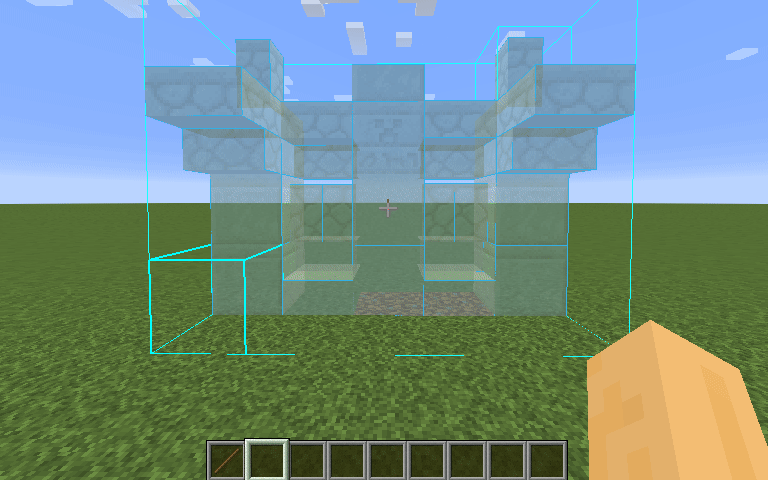

# Litematica Auto Printer

Fully automatic placement of schematics in a layer-by-layer fashion with support for multi-selection schematics.

## FORK FOR BUILDING THE 1.21 BUILDS ONLY.

I used Litematica Printer by Aleksilassila (@aleksilassila) as the base template for this mod. Please see the original repo for more details:
https://github.com/aleksilassila/litematica-printer

# How it Works

This modified version of Litematica Printer replicates the Litematica's "Paste Schematic" functionality, so instead
of placing blocks using player interaction, it uses commands to set blocks directly.

Please note that this mod only works in Single Player world and is intended for creation/recording purposes only.

## Installation

1. Download and install [Fabric](https://fabricmc.net/use/installer/) if you haven't already.
2. Download the latest Litematica Auto Printer release for your Minecraft version from the
   [releases page](https://github.com/AB-70/litematica-auto-printer/releases/latest) (The files can be found under
   "assets").
3. Download [Litematica + MaLiLib](https://www.curseforge.com/minecraft/mc-mods/litematica)
   and [Fabric API](https://www.curseforge.com/minecraft/mc-mods/fabric-api/) (≠ Fabric).
4. Place the downloaded .jar files in your `mods/` folder.

[If this is the first fabric mod you are installing, here's an informative video on how to install Fabric mods.](https://www.youtube.com/watch?v=x7gmfib4gHg)

## How To Use

## Issues

If you have issues with the printer, **do not** bother the original creator of
Litematica (maruohon) with them. Contact me instead. Feature requests or bugs can
be reported via [GitHub issues](https://github.com/AB-70/litematica-auto-printer/issues). I'll try to keep a todo list of things
I'm planning to implement and fix, so please look for duplicates there first.

Before creating an issue, make sure you are using the latest version of the mod.
To make fixing bugs easier, include the following information in your issue:

- Minecraft version
- Litematica version
- Printer version
- Detailed description of how to reproduce the issue
- If you can, any additional information, such as error logs, screenshots or **the incorrectly printed schematics**.

### List of know issues

Currently, the following features are still broken or missing:

- This mod does not support placing entities yet.
